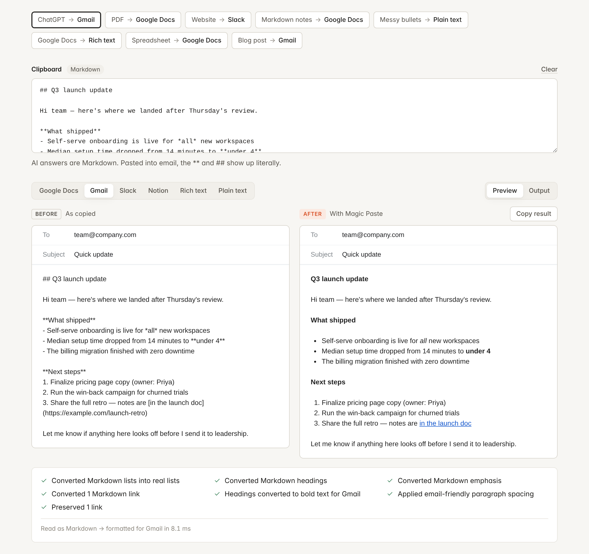
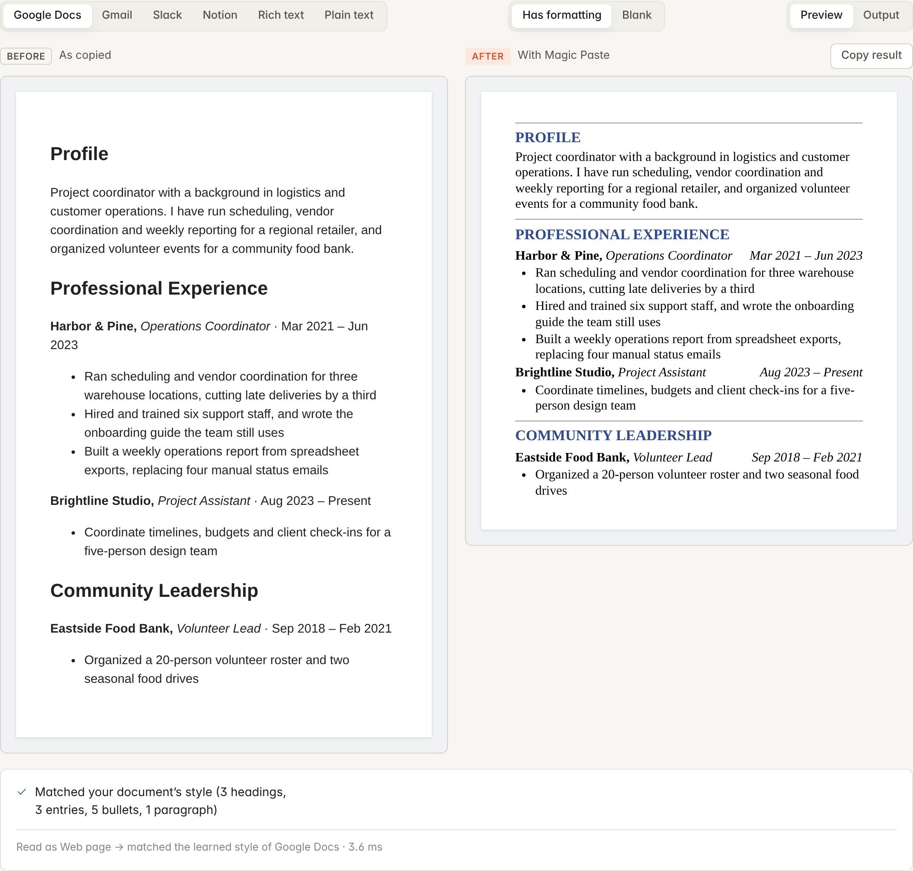
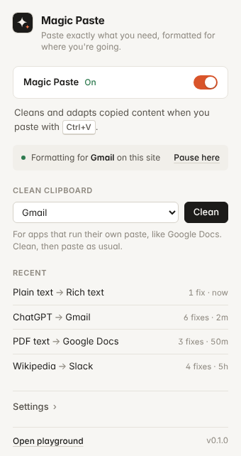

<p align="center"></p>

<h1 align="center">Magic Paste</h1>

<p align="center"><b>Paste exactly what you need, formatted for where you're going.</b><br>
A Chrome extension that makes <kbd>⌘V</kbd> / <kbd>Ctrl+V</kbd> destination-aware.</p>

<p align="center"><a href="https://nweinberg97.github.io/Magic-Paste/"><b>Website</b></a> · <a href="https://nweinberg97.github.io/Magic-Paste/playground.html">Try it in your browser</a> · <a href="https://nweinberg97.github.io/Magic-Paste/magic-paste-extension.zip">Download the extension</a></p>

<p align="center"></p>

---

## The problem

Copy and paste is the most-used integration between apps, and it's surprisingly bad at its job. The *content* survives the trip; the *formatting* rarely does:

- An AI answer pasted into Gmail shows `**bold**` and `## headings` literally.
- PDF text arrives with a hard line break at the end of every line, and words like `produc-` / `tivity` split in two.
- A paragraph from a blog brings its 42px serif headline, grey text and yellow highlight into your email.
- Google Docs exports every word wrapped in inline fonts, colours and stray `<br>`s.
- Bullets copied from notes arrive as `•`, `◦`, `▪`, `–` and tabs, not as a list.
- Spreadsheet cells become a ragged row of tab-separated text.

Each fix is small. Doing them by hand, dozens of times a day, is the tax.

## The solution

Magic Paste looks at **what you copied** and **where you're pasting**, rebuilds the content from its meaning (not its markup), and re-renders it the way the destination expects.

| Destination | What it gets |
|---|---|
| **Gmail** | Email-native paragraphs (`<div>` lines with blank-line spacers, like Gmail's own composer), headings as bold text, real lists, links, tables with a visible grid |
| **Slack** | Bold, italic, strike, code, links, lists and quotes. Headings become bold, tables become aligned monospace, images are left out |
| **Notion / rich editors** | Clean semantic HTML: headings, lists, quotes, code, tables. Zero styling |
| **Google Docs** | Clean structure that adopts your document's design: lists, bold, links, tables; headings as bold text by default (a setting switches to Docs' Heading styles). Delivered only through Docs' own paste handler |
| **Text fields** | Tidy plain text. Markdown stays Markdown; everything else gets clean `•` bullets and `text (url)` links. Single-line inputs get one line |

And when there is nothing to fix, it stays out of the way: the browser pastes normally.

### The rule: adapt to a design, keep the look in a blank page

One rule decides where formatting comes from, so there are no modes to pick:

| Pasting into… | Result |
|---|---|
| A document or message that already has formatting | Content takes on the **destination's** formatting |
| A blank document or message | Content keeps the **source's** look (fonts, sizes, colours, headings), repaired: light text from dark pages that would vanish on white, drop caps and giant letters, backgrounds, layout leftovers, broken lists and stray spacing are fixed |
| A text field or Slack | Always clean text / Slack formatting (they can't hold styles) |

Blankness is read from the editor itself. Google Docs is the exception: it draws its pages on a canvas, so Magic Paste can't see whether a Doc is empty. There, a learned style (below) means "this document has a design"; without one, the source look is kept. The confirmation card says which way the formatting went.

### Paste in your document's style

Clean is good; *matching* is better. Pasting new content into a document that already has a design (a resume template, a report, a brand doc) should land looking like the rest of that document, not like generic text.

Extensions can't read a Google Doc's formatting directly, but everything is on the clipboard the moment you copy from it. So:

1. In Google Docs this happens **automatically**: copying anything inside a Doc teaches Magic Paste that document's design. Anywhere else (or to teach it on purpose), copy a representative section (a heading, an entry line, a few bullets) and click **Learn this style** in the popup.
2. Magic Paste learns each role's look: section headings (font, size, colour, all caps, the rule above them), entry lines (and whether dates sit flush right), bullets and body text.
3. From then on, pastes into that document are rendered in its style. "Profile" arrives as your blue, all-caps **PROFILE** with its rule; "Harbor & Pine, Operations Coordinator … Mar 2021 – Jun 2023" arrives with the dates flush right in italics.

Styles are saved per Google Doc (by document id) or per site, and can be relearned or forgotten from the popup. Every learned value passes a strict CSS allowlist (font family, size, colour, spacing in plain units), so a style can't smuggle anything else into a page.

<p align="center"></p>

## How it works

```text
Copy
 ↓
Clipboard              text/plain, and often text/html
 ↓
Detect content         HTML · Markdown · PDF-wrapped text · spreadsheet rows · prose
 ↓
Normalize              → small document model (paragraph, heading, list, quote, code, table, link, emphasis)
 ↓
Detect destination     Gmail · Slack · Notion · Google Docs · rich editor · text field · code editor (skip)
 ↓
Apply strategy         the destination adapter renders only what that app supports
 ↓
Sanitize               allowlisted tags, escaped text, vetted URLs (by construction)
 ↓
Paste                  editor's own paste handler → direct insert → otherwise, normal paste
```

The core is a pure function, `transform(payload, { destination }) → { html, text, notes }`, that never throws. The extension, the popup and the playground are thin shells around it.

### Delivering the paste

Paste events are read-only: an extension can't rewrite the data an editor is about to receive. So when Magic Paste has something better, it cancels the original paste and delivers the cleaned version itself, most-native first:

1. **Text fields** use `execCommand('insertText')`, which keeps the undo stack and fires real input events that frameworks like React listen for. Falls back to `setRangeText`.
2. **Rich editors** get a *synthetic* paste event carrying the cleaned HTML. Framework editors (ProseMirror, Lexical, Slate, Quill 2, Gmail's composer) run their normal paste handling on it, keeping their internal state consistent. If no editor claims it, the HTML is inserted directly.
3. If neither works, the original event is left untouched and the browser pastes as usual.

## Product decisions

- **Never make paste worse.** Every uncertain path ends in a normal paste: settings not loaded yet, unknown input type, code editor, files on the clipboard, input over 1 MB, a parse error, or simply nothing to fix. The original event is only cancelled *after* the cleaned content has been delivered.
- **Rebuild from meaning, not markup.** Source HTML is never forwarded. Parsers read structure; renderers emit a fixed allowlist. That makes stripping styles and sanitizing the same operation.
- **Don't guess what isn't there.** Markdown is only interpreted with a strong signal (so `5 * 3 * 2` and `#1 priority` stay text). Plain text never gets invented headings. HTML headings come only from real `<h1>`–`<h6>`.
- **Destination-aware, but honest about it.** Each adapter declares how it is delivered. Google Docs draws its own canvas, so it is *editor-only*: the cleaned paste goes through Docs' own paste handler, and is never inserted into the page behind its back.
- **Pasted content should look like the document it lands in.** Pasting into an existing design (a resume, a report template) is the common case, so Google Docs headings arrive as bold text in the document's own style rather than Docs' large Heading styles.
- **Respect intent.** <kbd>⌘⇧V</kbd> / <kbd>Ctrl+Shift+V</kbd> (paste as plain text) is always the browser's. Code editors (Monaco, CodeMirror, Ace) and password fields are never touched. Any page can opt out with `data-magic-paste="off"`.
- **Never leave the user guessing.** After every paste into a text field, a small card in the corner says what happened: *Pasted cleanly* with what changed, *Pasted normally* with why (already clean, plain-text shortcut), or *Not cleaned* when an editor declined the cleaned version, with a **Copy cleaned version** button so the fix is undo and paste again. The popup keeps a "Last paste here" line for after the fact. Silent only when the reason is obvious (Magic Paste is off, or you didn't paste into a text field).
- **Explain, don't just do.** Every transformation reports what it changed ("Rejoined 2 paragraphs broken by hard line wraps", "Preserved 3 links"). The playground shows it; the toast summarises it.
- **Private by default.** Everything runs locally. The popup's history stores only labels and counts. To name the source app ("ChatGPT → Gmail"), the content script stores a short *hash* of copied text, never the text.
- **Learn by example, not by settings.** Matching a document's design could have been a style editor. Instead it's one action, copying a sample, because the user already has the design they want; they just can't hand it to the paste.
- **Small UI.** One toggle, a site status line, one-button style learning, a one-button clipboard cleaner, five rows of history, five settings. The in-page UI is a small toast that fades out after about two seconds.

## Supported environments

What this prototype does today, and how it was verified.

| Environment | Status | Verified |
|---|---|---|
| `<textarea>`, text `<input>`, `contenteditable="plaintext-only"` | Live interception | Automated end-to-end tests in Chromium with the built extension |
| Plain `contenteditable` editors | Live interception (direct insert) | End-to-end tests |
| Editors with their own paste handler (ProseMirror/Lexical-style) | Live interception (synthetic paste) | End-to-end test with a fixture editor that handles paste itself |
| Code editors, password/number/date inputs | Deliberately untouched | End-to-end + unit tests |
| Gmail, Slack, Notion | Destination adapters with live interception | Adapter output is unit-tested. **Not yet tested against the live apps** (needs signed-in accounts); they are reached through the same synthetic-paste path as above |
| Google Docs | Live interception, editor-only delivery; **Clean clipboard** as a backup | Adapter unit-tested; editor-only path end-to-end tested with a fixture. **Not yet tested in live Google Docs** |
| Chrome's PDF viewer, `chrome://` pages, Web Store | Not reachable by extensions | — |

## Browser limitations

- **Paste data is read-only.** Extensions can't modify `clipboardData` on a paste event, hence the cancel-and-redeliver approach above.
- **Google Docs** renders to a canvas and runs its own clipboard pipeline. Magic Paste hands it the cleaned content as a paste event; if Docs declines that event, nothing is inserted and the normal paste goes through. The popup's *Clean clipboard* is the backup. Guaranteed behaviour would need a Docs add-on.
- **Custom editors** that ignore synthetic paste events and don't accept `insertHTML` get a normal paste. Some editors may also need site-specific adapters for perfect results.
- **Already-open tabs** don't get the content script until they're reloaded (Chrome injects declared content scripts on navigation).
- **Images and files** pass through untouched. Turning a screenshot of text into text would need OCR.
- **Restricted surfaces** (`chrome://`, the Web Store, Chrome's built-in PDF viewer) don't run extensions at all. Text copied *from* a PDF is still cleaned when pasted elsewhere.
- **Clipboard permissions:** *Clean clipboard* needs `clipboardRead`, which Chrome shows as "Read data you copy and paste" at install.

## Test kit

`testkit.html` (popup → **Test kit**, or `http://localhost:5173/testkit.html` with `npm run playground`) has 16 hard specimens: AI answers, styled articles, dark-mode pages, Google Docs and Word exports, PDF text, spreadsheets, messy nested lists, VS Code, merged-cell tables, email signatures, emoji and right-to-left scripts, hostile HTML, a 5,000-line paste and tiny pastes. Each has a **Copy exactly** button, what to watch for, and what should happen in a formatted vs. a blank destination. A results grid (6 destinations × 16 specimens) exports as a Markdown table. Every specimen is also run through the engine in the test suite, in every destination, both ways.

## Demo

The playground runs the real engine with no installation:

```bash
npm install
npm run playground        # → http://localhost:5173/playground.html
```

It's also bundled in the extension: popup → **Open playground** (it opens automatically on first install).

In the playground:

1. Click a case (**ChatGPT → Gmail**, **PDF → Google Docs**, **Website → Slack**, …) and compare **Before · As copied** with **After · With Magic Paste** in a mock of the destination app.
   The last case, **New resume content → Your template**, shows style matching: the same content rendered in a resume template's learned look.
2. Switch destinations to see the same content adapt: Docs gets headings, Gmail gets bold lines and email spacing, Slack gets an aligned-text table, a text field gets clean text.
3. Read **What changed** for the explanation, or flip to **Output** for the exact `text/html` and `text/plain` that would be pasted.
4. Paste your own content into the **Clipboard** panel: it captures both HTML and text exactly as the extension would.
5. In **Try the real interceptor**, copy something from another tab and press <kbd>⌘V</kbd>. That box runs the same paste handler the extension injects into pages. Toggle Magic Paste off to compare with a normal paste.

<p align="center"></p>

## Installation

```bash
npm install
npm run build
```

1. Open `chrome://extensions` and turn on **Developer mode**.
2. Click **Load unpacked** and choose the `dist/` folder.
3. Refresh any tabs that were already open.

Then copy something messy and paste it into Gmail, Slack, a GitHub comment box, or any text field.

## Development

Requires Node 22+.

```bash
npm install
npx playwright install chromium   # browser for the HTML and end-to-end tests

npm run dev          # rebuild on change; then click ↻ on the extension in chrome://extensions
npm run playground   # build, watch and serve the playground on :5173
npm run typecheck    # tsc --noEmit
npm test             # all tests (~20s)
npm run test:unit    # Node-only engine tests (~1s)
npm run check        # typecheck + build + test
```

### Tests

115 tests on Node's built-in runner, in three layers:

- **Engine, in Node** (`tests/text.test.ts`, `render.test.ts`, `destinations.test.ts`): whitespace, malformed bullets, nested and numbered lists, Markdown emphasis/links/headings/tables, PDF reflow and de-hyphenation, spreadsheet rows, adapter output, settings, sanitization (dangerous URL schemes, escaping), destination and source detection.
- **Style matching** (`tests/style.test.ts`): learning headings, entries, bullets and fonts from copied Google Docs HTML; rendering new content in that style; rejecting hostile CSS; per-document scopes.
- **Engine, in Chromium** (`tests/html.test.ts`): HTML parsing uses the browser's `DOMParser`, so these run in a real browser via Playwright: style stripping, Google Docs and Word clipboard HTML, malformed HTML, scripts/handlers/hidden text, tables, images, code from editors, and every demo sample against every destination.
- **Extension, end to end** (`tests/extension.test.ts`): loads `dist/` into Chromium, writes real data to the system clipboard and presses <kbd>Ctrl+V</kbd> in textareas, inputs, a plain editor, a framework-style editor and a code editor; checks the on/off and per-site pause, the popup's activity log, and the playground's live box.

## Project structure

```text
src/
  engine/                  pure, framework-free formatting engine
    pipeline.ts            transform(): detect → parse → normalize → render; never throws
    detect-source.ts       which clipboard flavour to trust; where it likely came from
    parse-html.ts          clipboard HTML → model (Google Docs, Word, web, editors)
    parse-text.ts          plain text / Markdown → model (bullets, nesting, PDF reflow, tables)
    parse-inline.ts        emphasis, code, links, bare URLs
    lists.ts               flat items with levels → nested lists
    normalize.ts           source-independent cleanup
    model.ts               the document model
    render-html.ts         allowlisted HTML, per-destination profile
    render-text.ts         clean text or Markdown
    sanitize.ts            URL vetting and escaping
    report.ts              the "what changed" notes
    destinations/          adapters (Gmail, Slack, Notion, Google Docs, rich, plain) and detection
    style/                 learn a document's look from a copied sample; render in it; CSS allowlist
  content/                 content script: paste interceptor, target resolution, delivery, toast
  extension/               settings, activity log, learned styles, copy-origin fingerprints, Chrome API types
  popup/                   toolbar popup
  playground/              demo page and sample data
  background/              service worker (opens the playground on install)
  ui/                      shared design tokens and clipboard helpers
public/                    manifest and icons
tests/                     node:test suites, Playwright helpers, fixture page
scripts/build.js           esbuild build / watch / serve
```

**Stack:** TypeScript, esbuild and vanilla DOM. The UI is two small pages, so a framework would add weight without adding clarity; the engine has no runtime dependencies. Chrome APIs are typed in a small local declaration file (`src/extension/chrome.d.ts`) listing exactly the privileged APIs used.

## Roadmap

- **Smarter destination adapters:** Outlook, Linear, Jira, Confluence, GitHub Markdown, LinkedIn's composer
- **Deeper Google Docs integration** via an add-on, for guaranteed paste handling and matching named styles
- **More editors**, with per-editor adapters where the generic path falls short
- **User-defined preferences:** "always paste as plain text in X", heading levels, bullet style
- **Custom destination rules** for internal tools
- **AI-assisted formatting** for genuinely ambiguous input (opt-in, local where possible)
- **A native desktop clipboard manager**, bringing the same engine to every app, not just the browser
- **Team formatting standards:** shared rules for how content lands in company docs and channels

## License

MIT
